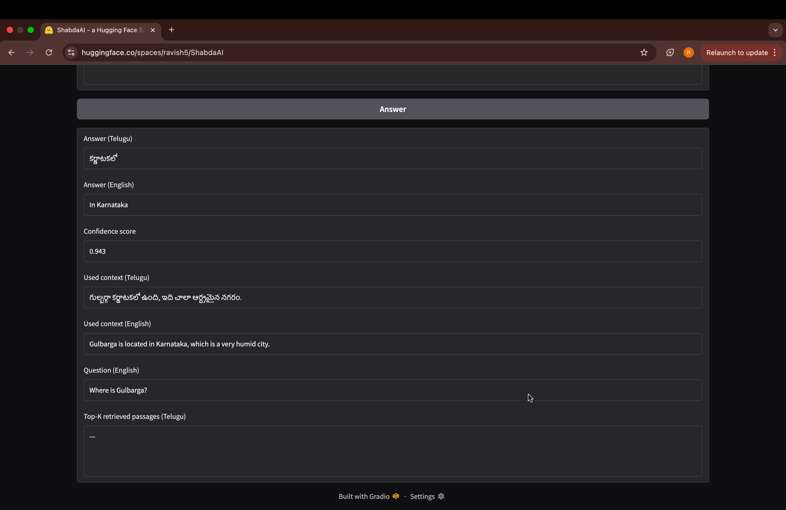
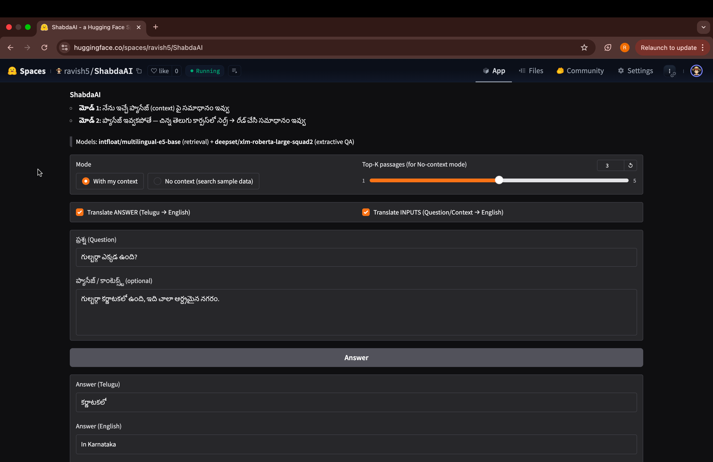

# 📘 ShabdaAI — Multilingual Indic Q&A (Telugu & Hindi ↔ English)

  
👉 **Live Demo:** [Try it on Hugging Face](https://huggingface.co/spaces/ravishanker/ShabdaAI)

---

## 🌍 Overview
**ShabdaAI** is a multilingual Q&A assistant built for **Telugu & Hindi ↔ English**.  
It supports two modes:
1. **With Context** — extractive QA from user-provided passages.  
2. **No Context** — retrieves relevant passages from a small Indic dataset (Telugu/Hindi corpus) and then answers.  

The app is fully **offline, local-first, and API-free**, with a public demo deployed on **Hugging Face Spaces**.  

---

## ✨ Features
- **Multilingual Q&A:** Telugu & Hindi ↔ English  
- **Dual-mode:**  
  - With Context (answers from your passage)  
  - No Context (retrieves Top-K passages and extracts answer)  
- **Auto Translation:** Input questions and contexts in TE/HI/EN, with optional auto-translation display  
- **Regex-based Preprocessing:** Handles Unicode quirks, punctuation normalization, ZWJ/ZWNJ cleanup  
- **Confidence-aware Answers:** Returns “Unknown” when model confidence is too low  
- **Deployment:** Gradio UI on Hugging Face Spaces  

---

## 🛠️ Tech Stack
- **Retrieval:** [intfloat/multilingual-e5-base](https://huggingface.co/intfloat/multilingual-e5-base)  
- **Extractive QA:** [deepset/xlm-roberta-large-squad2](https://huggingface.co/deepset/xlm-roberta-large-squad2)  
- **Translation:** [facebook/nllb-200-distilled-600M](https://huggingface.co/facebook/nllb-200-distilled-600M)  
- **Interface:** [Gradio](https://gradio.app/)  
- **Deployment:** [Hugging Face Spaces](https://huggingface.co/spaces)  

---

## 📂 Dataset
- **L3Cube IndicQuest** (Telugu & Hindi question-context-answer pairs)  
- **Custom CSV Passages** for added coverage  
- Example entries:  
  - **Telugu:** తెలంగాణ రాష్ట్ర రాజధాని ఏది? → హైదరాబాద్  
  - **Hindi:** भारत का पहला राष्ट्रपति कौन था? → राजेन्द्र प्रसाद  

---

## 🚀 Deployment
- Packaged with Gradio and deployed on Hugging Face Spaces  
- Optimized with **env-based model sizing** (base/large) to run on CPU  

👉 Try it here: [ShabdaAI on Hugging Face](https://huggingface.co/spaces/ravishanker/ShabdaAI)

---

## Screenshots

### Auto-translation (Telugu → English)
The app automatically translates both the **inputs** (question/context) and the **answers**, allowing seamless interaction between Telugu and English.

---

### Context-based Answering
When context is provided, the model answers directly from the passage, in **Telugu and English** side-by-side.

---

## 📜 License
This project is open-source under the **MIT License**.  
